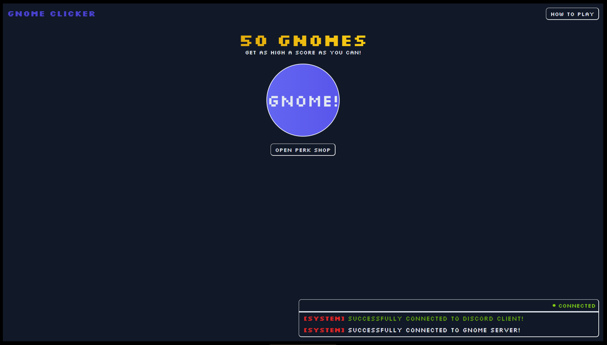

# gnome-clicker

Gnome Clicker (like Cookie Clicker) Discord Activity.

[]()

## Prelude

This project serves as a test of the Discord Embedded App SDK for creating Discord
Activities<sup>[1]</sup><sup>[2]</sup><sup>[3]</sup>. As such, testing, features, etc. are kept to
only what was necessary. See [Features](#features) for more information about what's available.

See [Disclaimers](#disclaimers) for important information about the project.

Since you might be curious:

**Why Gnome Clicker?**<br>
idk it seemed kinda funny

### Architecture

This project is written purely in TypeScript using SvelteKit. Specific implementation details are
below.

#### SPA over SSR

SvelteKit, by default, renders using Server-Side Rendering (SSR), however, Discord requires
Activites to be Single Page Apps (SPAs), and for SvelteKit to render in such a way, SSR needs to be
disabled.

#### Server-Client Architecture

The client sends a GET request to an endpoint to initiate the Server-Sent Events (SSE)
stream<sup>[4]</sup><sup>[5]</sup>. The server uses this stream to send custom (protocol)[#protocol]
messages to clients. For client -> server messages, the client POSTs protocol messages to the same
endpoint.

The ideal approach here would be to use websockets, however, I decided against it for a few reasons:

-   `cloudflared` (the tunnel I was using to expose my internal IP) doesn't currently support
    `ws://`/`wss://` protocols (not end of the world, but would have to look for other tunnel
    solutions, or just port forward).
-   Complexity of adding a websocket server to run with SvelteKit (+ introducing another library).
    It would be my first time using websockets with SvelteKit so there's quite a few unknown variables.
-   This is a low scope project; best to avoid unnecessary complexities.

#### Protocol

The protocol is fairly simple: "events" are serialized into JSON with some extra identifying header
information.

An event is essentially like a packet in traditional multiplayer games; it contains all necessary
information related to an action or update.

The full client spec can be found in [client.ts](./src/lib/protocol/client.ts) and the server spec
in [server.ts](./src/lib/protocol/server.ts).

Importantly, included in the client message header are the following:

-   `instanceId` The id of the currently running activity
-   `clientId` The user's id
-   `eventType` The id of the event (used for deserialization)
-   `payloadJson` The JSON serialized event

Similarly, the server message header includes the following:

-   `eventType` The id of the event (used for deserialization)
-   `payloadJson` The JSON serialized event

For full information related to the events, see the client/server protocol code (the code is quite
straightforward).

### Features

Gnome Clicker includes the following features:

-   A Perk Shop to buy various perks
    -   `Auto Gen` perk to auto generate Gnomes
    -   `Big Gnome` perk to get more Gnomes per click
-   An Activity Log, containing game related, system, etc. messages
-   A menu for how to play Gnome Clicker
-   ... and of course, a button to click to generate Gnomes

### Disclaimers

The project in its current state is, for the most part, finished. Some important things to note:

-   Lack of mobile support. Though some parts of the UI do resize to fit mobile screens, the UI in
    its entirety does not properly support mobile.
-   Not production ready. Though the game does work, it hasn't been tested with bigger workloads.
    It's also probably better to swap to using websockets in a production environment.

### Appendix

[1] https://discord.com/build/embedded-app-sdk

[2] https://discord.com/developers/docs/activities/overview

[3] https://github.com/discord/embedded-app-sdk

[4] https://developer.mozilla.org/en-US/docs/Web/API/Server-sent_events

[5] https://developer.mozilla.org/en-US/docs/Web/API/Server-sent_events/Using_server-sent_events

## Developing

A Discord Activity is essentially a website, so the development process is very similar to that of a
regular website. It is important to note that though you _can_ develop activites using your browser,
Discord related functionality will not work, and thus you should only use the browser to work on the
UI itself and less so implementing features.

Install dependencies with `npm install` (or `pnpm install` or `yarn`), then start a development
server:

```bash
npm run dev

# or start the server and open the app in a new browser tab
# (should only be used for working on the UI)
npm run dev -- --open
```

### Developing and Preview on Discord

-   Obtain an external URL that points to the localhost URL provided by `npm run dev` (either port
    forward, or use a tool like `cloudflared`).
-   Follow the steps found on [Building Your First Activty in Discord](https://discord.com/developers/docs/activities/building-an-activity)
    to create a new app on Discord.
-   Within your app's details on the Discord Developer Portal, you can map `/` to your external
    URL in the `URL Mappings` section.
-   Once that's done, you can follow the instructions in the Activity docs linked above to start
    your activity. Essentially, once you enable Developer Mode within Discord itself, you can join a
    voice channel, open up the Activities menu, and start your activity (but do follow the docs
    linked above in case anything changes).

## Building

To create a production version of the app:

```bash
npm run build
```

You can preview the production build with `npm run preview` (only to view the UI).
